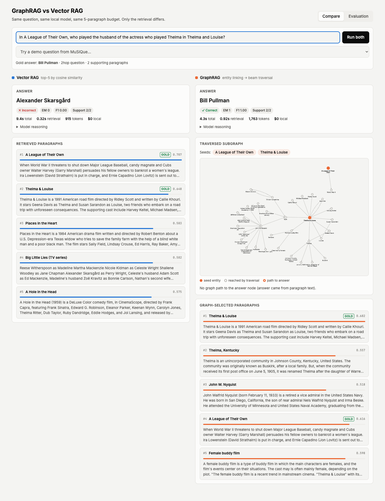
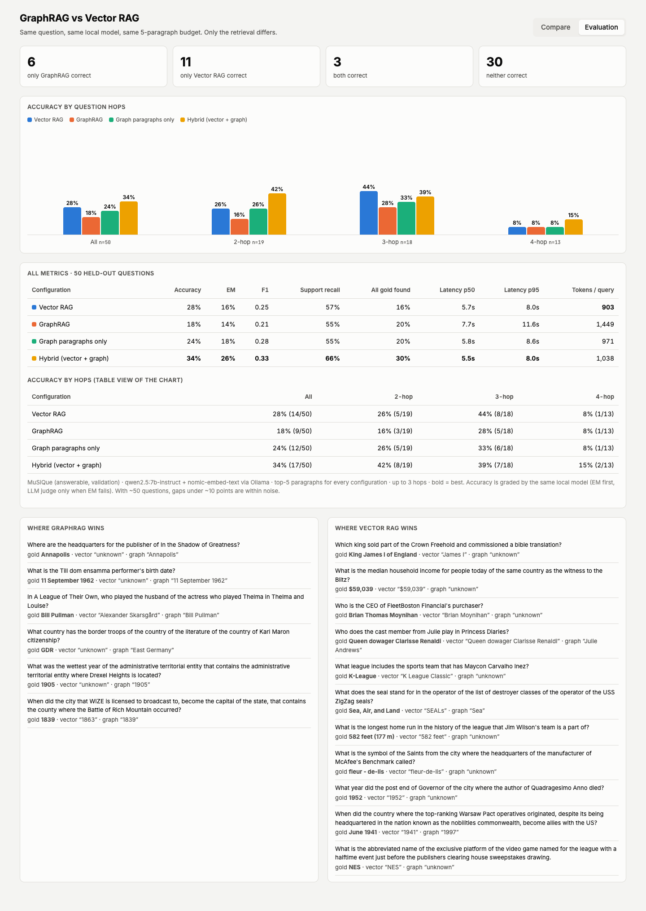
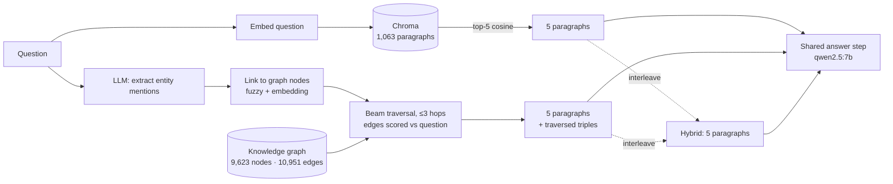

# GraphRAG vs Vector RAG

A side-by-side comparison of classic vector RAG and GraphRAG on multi-hop questions, running fully locally with Ollama. It needs no API keys and costs $0 per query.

You ask one question and both pipelines answer it. The left column shows the paragraphs vector search retrieved, with their scores. The right column shows the knowledge-graph subgraph GraphRAG traversed. Every accuracy number comes from an evaluation on 50 held-out questions.



## Results

MuSiQue (answerable, validation split), 50 held-out questions. All configurations use `qwen2.5:7b-instruct`, the same answer prompt, and the same budget of 5 paragraphs. Only the retrieval differs.

| Configuration | Accuracy | EM | F1 | Support recall | All gold found | Latency p50 | Tokens/query |
|---|---|---|---|---|---|---|---|
| Vector RAG | 28% | 16% | 0.25 | 57% | 16% | 5.7 s | 903 |
| GraphRAG (paragraphs + triples) | 18% | 14% | 0.21 | 55% | 20% | 7.7 s | 1,449 |
| Graph paragraphs only (ablation) | 24% | 18% | 0.28 | 55% | 20% | 5.8 s | 971 |
| **Hybrid: vector + graph (ablation)** | **34%** | **26%** | **0.33** | **66%** | **30%** | 5.5 s | 1,038 |

Accuracy by number of hops:

| Configuration | 2-hop (n=19) | 3-hop (n=18) | 4-hop (n=13) |
|---|---|---|---|
| Vector RAG | 26% | **44%** | 8% |
| GraphRAG | 16% | 28% | 8% |
| Graph paragraphs only | 26% | 33% | 8% |
| Hybrid | **42%** | 39% | **15%** |



### What the numbers say

1. **Pure GraphRAG lost to vector RAG on this setup** (18% vs 28%), and the bottleneck is answering. The two find about the same share of gold paragraphs (55% vs 57%), and GraphRAG finds *every* gold paragraph more often on 2-hop questions (53% vs 37%). It still answers worse.
2. **The triple list is noise for a 7B model.** Removing it and keeping the same graph-selected paragraphs raises accuracy from 18% to 24%. With the triples, the model answers "unknown" more often (17 vs 14 times). A larger model might use the triples, but that's untested here.
3. **Graph and vector retrieval find different paragraphs, and combining them scored best.** Interleaving the two lists (v1, g1, v2, g2, v3) under the same 5-paragraph budget gives the best result on every quality metric. It finds more gold paragraphs than vector RAG on 16 questions and fewer on 4 (sign test p ≈ 0.01), the only statistically significant result in this study.
4. **Four-hop questions are hard for every configuration.** No setup finds all the gold paragraphs for any 4-hop question, and the 7B model rarely finishes a four-step chain.

With 50 questions, the accuracy differences are not statistically significant. Paired sign tests give p = 0.55 for hybrid vs vector and p = 0.33 for GraphRAG vs vector. The raw per-question results are in [`docs/results.json`](docs/results.json).

### A worked example

*"In A League of Their Own, who played the husband of the actress who played Thelma in Thelma and Louise?"* (gold answer: Bill Pullman)

Both pipelines retrieved both gold paragraphs. Vector RAG filled its other three slots with paragraphs that look similar but don't help, including *Big Little Lies*, where Alexander Skarsgård plays a husband. The model answered "Alexander Skarsgård". GraphRAG's other slots came from the entities it linked, and the model answered "Bill Pullman".

The reverse also happens. *"Who has the most hits in the history of the organization that includes the team Jim Wilson was released by?"* fails for GraphRAG because the extracted triple says Jim Wilson was released by "Indians". Entity resolution can't tell whether that means the Cleveland Indians or a 1920s football team of the same name.

## How it works



**Offline, once:**

- **Corpus.** 60 MuSiQue questions (24 two-hop, 20 three-hop, 16 four-hop). Their paragraphs, gold and distractor, are pooled into one shared corpus of 1,063 paragraphs, so every question is answered against the whole corpus. 10 questions are held out for the demo dropdown; 50 are used for evaluation.
- **Vector index.** Each paragraph is embedded with `nomic-embed-text` (using its `search_document:` prefix) and stored in Chroma.
- **Triple extraction.** The 7B model reads every paragraph and writes `subject | relation | object` lines, one per fact. This line format uses about 40% fewer output tokens than JSON, with similar quality. Results are cached and resumable, and the full run takes about 2.5 hours on an M4.
- **Entity resolution.** Names are matched in two stages:
  1. Normalized exact match. Case, punctuation and leading articles are ignored.
  2. Fuzzy match. Every word pair must match on its own, either as a plural or adjectival suffix, or as a near-identical spelling that starts with the same letter.

  The second rule exists because whole-string similarity merged *Cleveland Browns → Barons*, *Russia → Prussia*, *Santa Claus → The Santa Clause* and *World War I → II*. Every merge is logged to `artifacts/merges.json` for review.

**At query time (GraphRAG):**

1. **Find seed entities.** The LLM lists the proper names in the question, and each is linked to a graph node by fuzzy or embedding match.
2. **Traverse.** Starting from the seeds, the search keeps the 12 edges per hop that best match the question embedding. It never passes *through* hub nodes such as "United States", and the same fact extracted from several paragraphs counts only once.
3. **Pick 5 paragraphs.** Paragraphs are chosen by their best-scoring edge. Each hop's best paragraph gets a reserved slot, because otherwise hop-1 edges crowd out the deeper hops that multi-hop questions need.

**Grading:** EM and F1 follow the SQuAD/HotpotQA normalization and take the best score over the gold answer and its aliases. A local LLM judge runs only when EM fails, to catch correct paraphrases such as *"East Germany"* for *"GDR"*. Support recall is the share of gold supporting paragraphs a pipeline retrieved.

## Run it locally

You need macOS or Linux, Python 3.11+, Node 20+, and [Ollama](https://ollama.com). It was tested on an Apple M4 with 16 GB.

```bash
make setup     # venv, npm install, pull qwen2.5:7b-instruct + nomic-embed-text
make data      # sample MuSiQue
make index     # vector index (~15 s)
make extract   # triple extraction (~2.5 h, resumable: rerun to continue)
make graph     # entity resolution + graph (~3 min)
make eval      # 4 configurations × 60 questions (~25 min)
make dev       # API on :8000, UI on http://localhost:5173
```

| Path | What it does |
|---|---|
| `backend/vector_rag/` | Chroma index and top-k retrieval |
| `backend/graph_rag/extract.py` | triple extraction with a resumable cache |
| `backend/graph_rag/resolve.py` | entity resolution (unit-checked against known false merges) |
| `backend/graph_rag/query.py` | entity linking, beam traversal, paragraph selection |
| `backend/hybrid.py` | interleaved vector + graph retrieval |
| `backend/answer.py` | the answer prompt shared by every configuration |
| `backend/eval/` | metrics and the resumable eval runner |
| `frontend/` | React + Vite + Cytoscape.js UI |

## Limitations

- **Small eval set.** 50 questions means accuracy gaps under about 10 points are noise. Only the retrieval gain from the hybrid is statistically significant.
- **Self-grading.** The same local model answers and judges, so judge errors are possible. EM is reported alongside as a check that doesn't depend on the model.
- **One small model.** Everything runs on a 7B model. The finding that "triples hurt" may not hold for larger models.
- **Latency comparisons.** Vector and GraphRAG ran in one session, and the two ablations in a separate, later session, so compare latency only within a session.
- **Entity resolution is string-based.** It uses no context, so ambiguous short names (*"Indians"*) can link to the wrong entity.

## Notes from building it

- HotpotQA was the first dataset, but vector search already found 94–100% of the gold paragraphs, which left GraphRAG nothing to improve. MuSiQue is built so that single-lookup shortcuts fail.
- Local 7B models can loop. One extraction generated 15,833 tokens before it was cut off. Every call now sets `num_predict`.
- Ollama can get stuck in "Stopping…" while unloading a model in the middle of a job, which blocks every later request. `keep_alive="1h"` avoids this.
